# Zastosowanie analizy SHAP w analizie sentymentu metodami NLP

Model służący do analizy sentymentu tweetów zebranych w zbiorze danych
[\"Trump Tweets\"](https://www.kaggle.com/datasets/austinreese/trump-tweets) i analiza SHAP.

### Autors

Szymon Kozioł, Ihnatsi Yermakovich, Michał Sienkiewicz

## Cel projektu

Celem ćwiczenia było stworzenie modelu do badania postrzegania
komentarzy oraz analiza SHAP w celu zbadania wpływu poszczególnych słow
na percepcję.

## Opis kluczowych plików

- `preprocessing.ipynb` - Załadowanie datasetu i jego wstępny
  preprocessing wraz z określeniem wartości sentymentu dla danego
  tweetu.

- `model_2.ipynb` - Stworzenie modelu i jego wytrenowanie

- `analysis.ipynb` - Analiza SHAP sporządzonego modelu

Aby przenieść dane z jego notebooka do drugiego, konieczne było
zapisanie tych danych na dysku. W tym celu skorzystaliśmy z modułu
pickle. Dane zostały zapisane w katalogu `data` w repozytorium.

W skład zapisywanych danych wchodzą:

- `X_train.pkl` - Macierz danych trenujących

- `X_train.pkl` - Macierz danych testujących

- `Y_train.pkl` - Macierz kategorii do trenowania

- `Y_test.pkl` - Macierz kategorii do testowania

- `vocabulary.json` - Słownik wyrazów po tokenizacji w postaci \<słowo\>:\<idx\>

Utworzony model został zapisany pod scieżką
`models/trump_tweets_model_v2.pkl`. Podczas analizy SHAP obliczenie
tzw `shap_values` wymagało bardzo dużych zasobów obliczeniowych
dlatego zdecydowaliśmy się zapisać uzyskane wartości pod ścieżką
`models/kernel_shap_values.pkl`.

## Inne implementacje modelu

W ramach projektu utworzyliśmy także inny model oparty na bibliotece
`xgboost`, notebook `model_0.ipynb` implementuje wspomniały model
wraz z preprocessingiem. Spróbowaliśmy także innego podejścia do
wykonania modelu w którym w ramach wejścia do modelu podajemy wektor
słów w podstacji np [32,45,67,0,0] gdzie wartości liczbowe odpowiadają
poszczególnym unikatowym słowom z słownika, natomiast zera to padding by
uzyskać jednolity rozmiar wejścia modelu. Implementacja takiego
podejścia wraz z preprocessingiem i analizą SHAP znajduje się w pliku
`model_1.ipynb`.

## Porównanie analizy SHAP

Poddanie analizie SHAP `modelu_1` było znacznie mniej wymagające
obliczeniowo niż `modelu_2`. Niestety jednak przy takim podejściu nie
można zinterpretować wykresów innych niż `force_plots` ponieważ
poszczególne features (słowa) zmieniają pozycje w wektorze danych
wejściowych modelu. Feature#1 (trump) który dla tweeta nr X był
pierwszym indeksem w vektorze danych wejsciowym może się okazać indeksem
30 dla tweeta nr Y co uniemożliwa poprawną analize wpływu featerów na
wynik modelu w odniesieniu do wielu tweetów.

## Zbiór danych

W projekcie wykorzystaliśmy dataset [\"Trump
Tweets\"](https://www.kaggle.com/datasets/austinreese/trump-tweets):

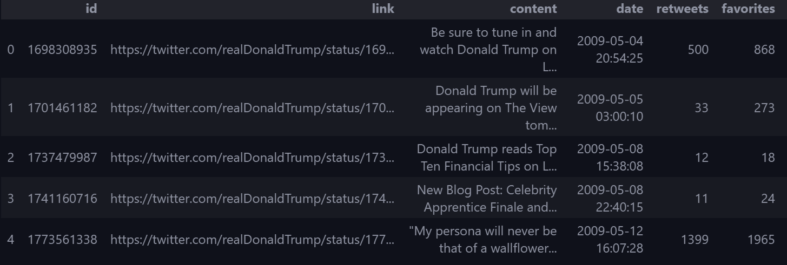


W ramach analizy sentymentu potrzebna jest tylko jedna kolumna o nazwie
*content*. Tak prezentują się dane dostępne w ramach tej kolumny.

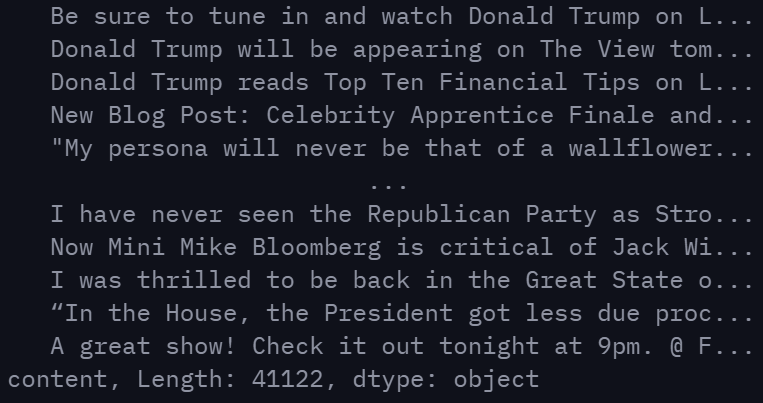

# Preprocessing danych

Zanim dane będzie można poddać analizie należy je odpowiednio
przygotować. Z tweetów należy wyciągnąć tylko najważniejsze słowa
pomijając nieużyteczne słowa jak spójniki czy linki.

Zawartość tweetów przepuściliśmy przez filtr `stopwords` czyli słów,
które występują często w postach jednak nie mają realnego wpływu na ich
interpretacje. W stopwords również umieściliśmy emoticony, które są
często wykorzystywane w tego typu postach.

Przykładowe stopwords


```text
the, a, an, another, for, an, nor, but, or, yet, so, in, under, towards, before
```

Następnie w postach zastąpiliśmy wielokrotne występowania spacji
pojedynczymi spacjami, umieszczone w poście URLe zastąpiono stringiem
"URL", a oznaczenia innych użytkowników zastąpiono stringiem
"MENTION".

W kolejnym kroku wykorzystaliśmy klasę `SentimentIntensityAnalizer` do
określenia sentymentu każdego postu. Nadane wartości należą do
przedziału od -1 do 1, gdzie -1 określa negatywne przesłanie, natomiast
1 określa pozytywne przesłanie postu.

Przykładowe zdania z określonym sentymentem:

### +0.9422
> AnnCoulter has been amazing. We will win and establish strong borders, we will build a WALL and Mexico will pay. We will be great again!      

### +0.1280
> Israel is being barraged by rockets from Gaza recently. They must respond accordingly in defense of their citizens.

### -0.9864
> It is outrageous that Poisonous Synthetic Heroin Fentanyl comes pouring into the U.S. Postal System from China. We can,
and must, END THIS NOW! The Senate should pass the STOP ACT -- and firmly STOP this poison from killing our children and
destroying our country. No more delay!

Przyjęliśmy następujące założenia odnoście klasyfikacji sentymentu:

- x >= -0.2 and x <= 0.2 - Sentyment neutralny

- x > 0.2 - Sentyment pozytywny

- x < -0.2 - Sentyment negatywny

Następny krok preprocessingu stanowiła tokenizacja postów i utworzenie
binarnego wektora słów. Jesteśmy w stanie wziąć pod uwagę 5000
unikalnych słów. Każdy tweet jest zamieniany na 5000 elementowy wektor
binarny gdzie wartość `1` określa obecność danego słowa, natomiast
`0` brak obecności słowa w tweecie. Taka prezentacja danych pozwoli
nam nie tylko na analizę wpływu słowa na poszczególny tweet, ale i na
cały zbiór.

Następnie dzielimy zbior danych na uczący i testujący. Cześć danych
uczących stanowi 80% całego zbioru.

Ostatecznie do modelu przesyłamy wektor wartości (N x 5000), gdzie N
jest ilością postów w zbiorze uczącym.

## Model

W celu zbudowania modelu wykorzystano bibliotekę Keras. Poniżej jest
przedstawiony schemat modelu:

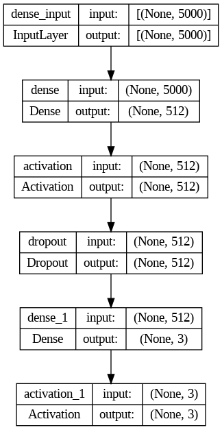

Model składa się z następujących sekwencyjnie uruchomianych warstw:

- Warstwa 1: `Dense`. Gęsto połączona warstwa NN.
  $output = activation(dot(input, kernel) + bias)$. Użyto liniowej
  funkcji aktywacji.

- Warstwa 2: `Activation`. Używamy funkcji aktywacji relu po
  ostatniej warstwie. Czyli usunięto ujemne wartosci:
  $f(x) = max(0, x)$.

- Warstwa 3: `Dropout`. W celu zapobiegnięcia przeuczeniu, wyłączane
  są przypadkowo pojedyncze neurony.

- Warstwa 4: `Dense`. Stworzono jeden layer z 3 neuronami dla każdej z klas: `Negative, Neutral, Positive`

- Warstwa 5 `Activation`. Użyliśmy funkcji aktywacji softmax. Cześto
  używa się jej kiedy musimy określić przynależność do n klas. Jest
  ona generalizacją funkcji sigmoid, którą byśmy zastosowali, gdybyśmy
  mieli 2 klasy np. negative i positive.

Widzimy, że model jest bardzo prosty, a po jego trenowaniu uzyskaliśmy
następujące wyniki:

| Metryka    | Wartość |
|------------|---------|
| Accuracy | 0.9167  |
| Precision   | 0.9151  |
| F1 Scor   | 0.9168  |


Biorąc pod uwagę powyższe metryki widzimy, że model działa
satysfakcjonująco.

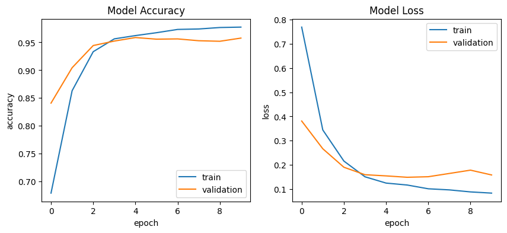

Widzimy, że funkcja dokładności w oczekiwany sposób rośnie (jej wygląd
jest bardzo podobny do tych, uzyskiwanych na laboratorium), a funkjca
strat maleje. Jest to jeszcze jedno potwierdzenie dobrze wytrenowanego
modelu.

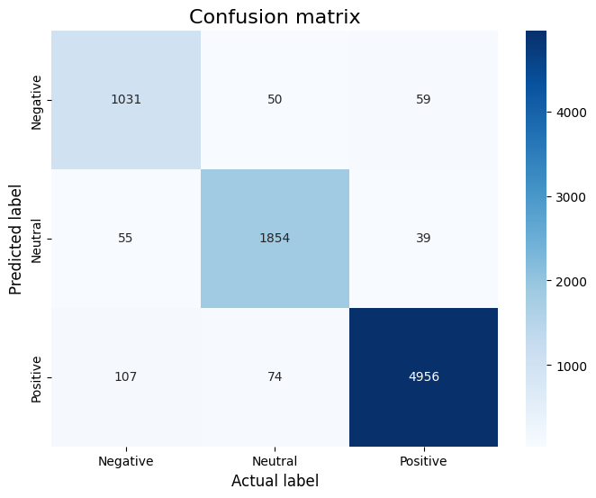

Ostatecznie do analizy Shap wysyłamy wytrenowany model oraz dane uczące
i testujące.

## Analiza Shap

Ze względu na prezentację danych dla dokładnie tego modelu analiza shap
(dla pierwszych 100 tweetów) wymagała dużych zasobów i podczas
obliczania shap values potrzebowało ~40 GB RAM
oraz ~35 GB VRAM. Obliczenia przeprowadzaliśmy na
maszynce z 84 GB RAM, 40 GB VRAM oraz 12 CPU Cores.

## Force Plots

Force Plots pozwalają na wizualizację wpływu poszczególnych cech
(features, w naszym przypadku poszczególnych słow) na wyniki modelu.
Force Plot składa się z poziomych słupków, gdzie każdy słupek
reprezentuje wpływ cechy na uzyskany wynik dla danego zdania
(instancji). E[f(x)] - base value, jest wartością, którą się uzyskuje
uśredniając uzyskane wartości dla całego zbioru dla danej klasy
(Negative, Neutral lub Positive). Słupki skierowane w lewo (niebeskie)
wskazują na wartości cech, które obniżają prognozę, podczas gdy słupki
skierowane w prawo (czerwone) wskazują na wartości cech, które
zwiększają prognozę. Ostatecznie uzyskany przez model wynik jest
pokazany jako f(x).

Analizie poddany następujący tweet:

> Read what Donald Trump has to say about daughter Ivanka's upcoming
> new book, The Trump Card: http://tinyurl.com/ycsqmda

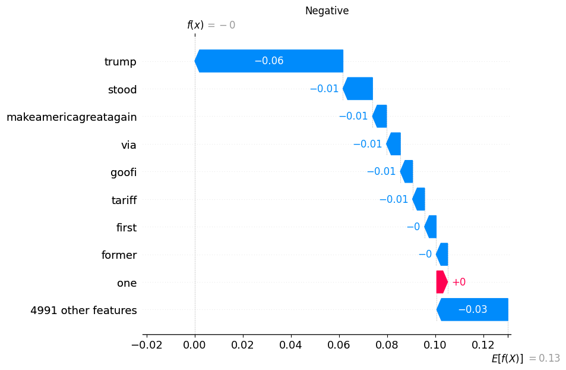

Dla powyższego wykresu można zaobserwować iż na negatywny odbiór tweetu
najbardziej wpływa słowo "trump" zmniejszajać negatywną percepcję.

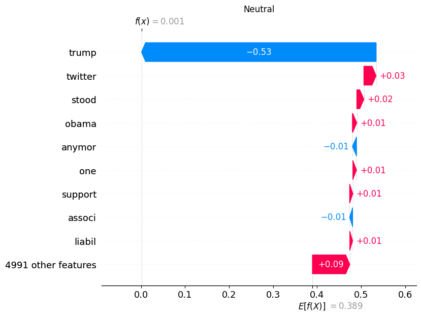

Tutaj widzimy, że oprócz tego, że słowo "trump" zmniejsza neutralną
percepcję, słowo "twitter" ją zwiększa. Ale słowa "twitter" nie ma w
rozpatrywanym tweecie. Jest to spowodowane sposobem przedstawiania
danych uczących, gdzie do modelu przekazywany jest wektor o długości
5000 (5000 słów) o wartościach binarnych (gdzie 1 mówi o istnieniu słowa
w tweecie, a 0 wskazuje na jego brak). Jak było opisane wyżej pozwoli
nam to na przedstawienie wpływu słowa na cały zbior, a nie na pojedynczy
tweet. Oczywiście w odpowiednim miejscu wektora dla słowa twitter jest
ustawione 0 (brak słowa), natomiast ten fakt też wpływa na uzyskany
wynik, który należy interpretować jako: \"brak słowa twitter zmniejszyło
neutralny odbiór rozpatrywanego tweetu\". W repozytorium został
umieszczony plik `model_1.ipynb` w którym model jest zbudowany w inny
sposób, co pozwala na przedstawienie wpływu na zdanie tylko słow, które
są obecne w tym zdaniu.

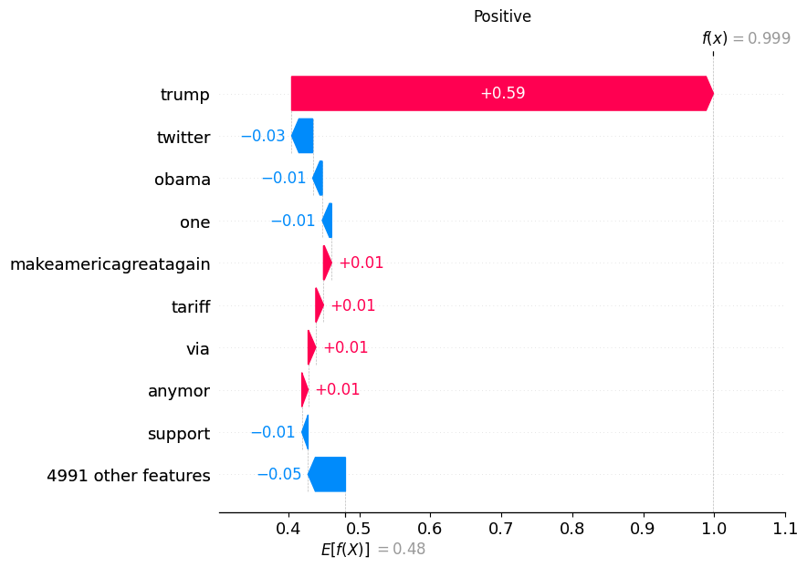

W przypadku pozytywnego odbioru widzimy, że obecność słowa "trump"
miało mocny dodatni wpływ na pozytywny odbiór tweetu.

Wykresy te można także przedstawić w następujący sposób.


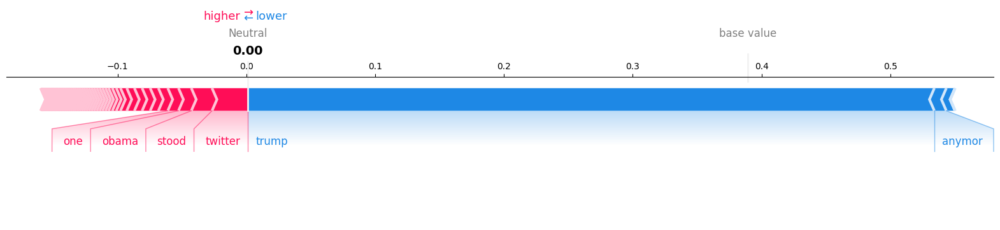

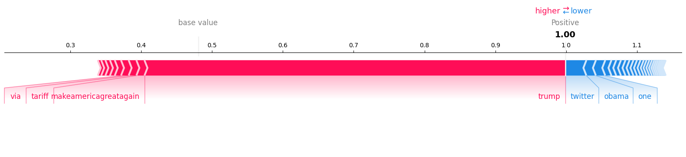

Sposób przedstawiania zależy na wygodzie i z każdej postaci da się
wyciągnąć uzyskane wnioski.

Natomiast trochę odmienną formą prezentacji (ale dalej force plot) jest
przedstawienie na jednym wykresie wszystkich 100 zdań:

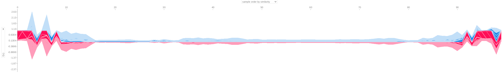
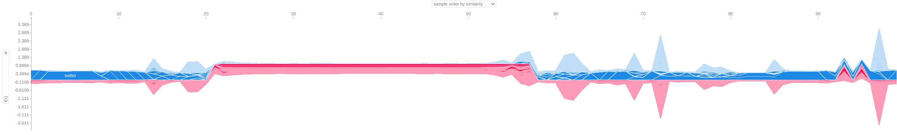


Na osi X są poszególne tweety, a po osi Y są wartości, które kształtują
ostateczny wynik. Z wykresów możemy wyciągnąć wniosek, że mamy sporo
podobnych (ze względu na odbiór) tweetów.

## Violin plots

Violin Plot pokazuje dla każdej klasy najbardziej znączące feature
(słowo). Dla każdego feature jest przedstawiony "violin". Na osi X są
wszystkie wartości, które w całej próbce przyjmowało słowo, a wysokość
dla poszczególnej wartości X pokazuje częstotliwość występowania.
Outlinery sa pokazane jako kropki. Kolor natomiast pokazuje wartość
featurea, czyli np. czerwony kolor pokazuje mocny pozytywny impact.


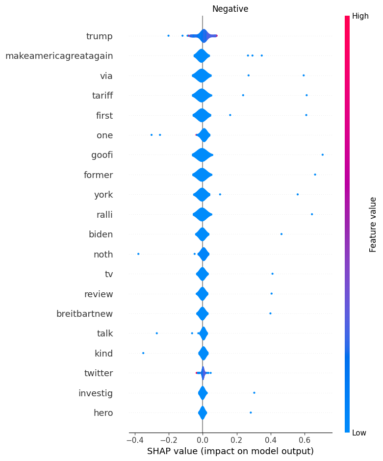

Widzimy, że słowo "trump" jest najważniejszym słowem które przy małych
wartościach ma mały pozytywny impact na negative (go zwiększa). Zwiększa
też neutral oraz obniża positive. Być może nie jest to widoczne dla
pokazanego na goorze tweeta, ale przy pozostalych najczesciej tak jest:

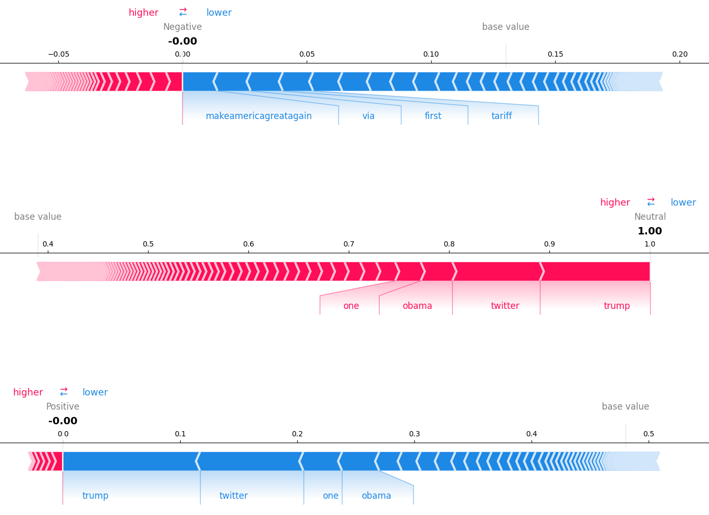
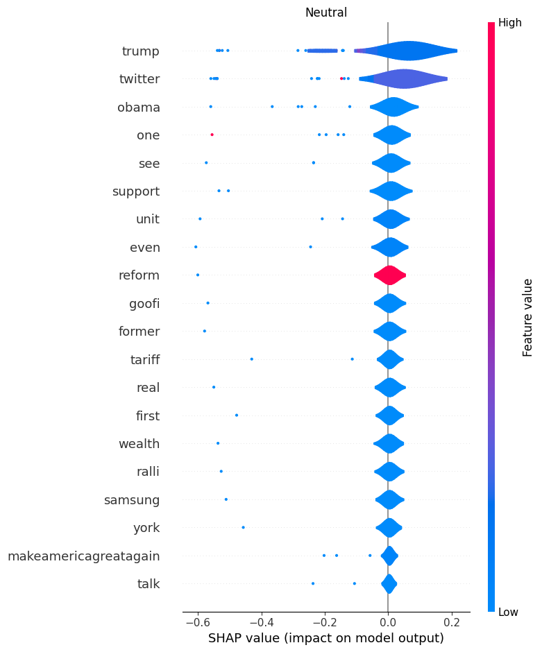
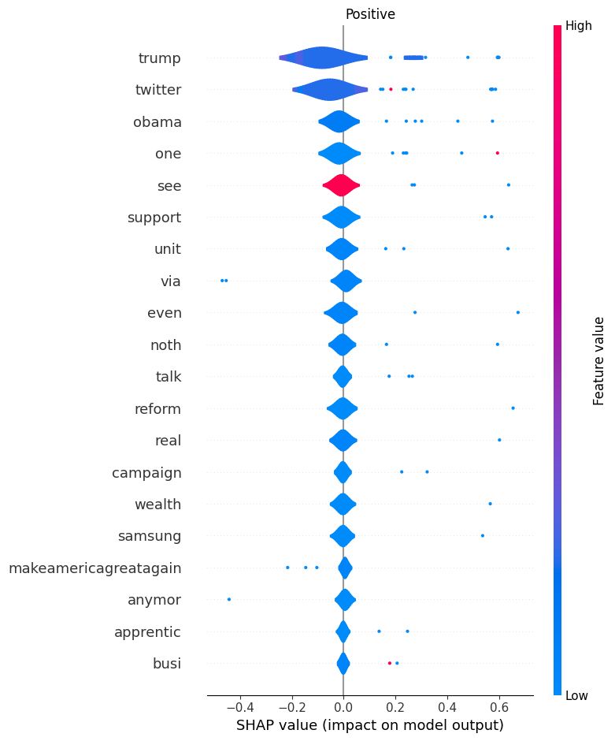

W tym przypadku widzimy, że słowo "see" ma dużą wartość. Ciekawym
jest, że samego słowa "see" albo z poprzedniego punktu "reform"
wystarcza, aby model powiedział, że odbiór będzie pozytywny:

```python
inp = [0] * 5000
inp[vocabulary['see']-1] = 1
model.predict([inp])
model.predict([inp])
# Output: [6.9787461e-06, 5.7770885e-03, 9.9421591e-01]
```

Na koniec chceliśmy przedstawić jeszcze jeden typ plotu: layered
violinale nie udało nam się wymusić działania kolorów, a bez nich trudno
powiedzieć jaka wartość featurea ma jaki wpływ. Przy plotowaniu z
kolorem plotowanie zaczyna się od pierwszych niebieskiego (malych value)
i rozchodzi sie po violin do góry i w dół tak, że na granicach będziemy
mieli bardziej czerwony kolor (duże wartości).

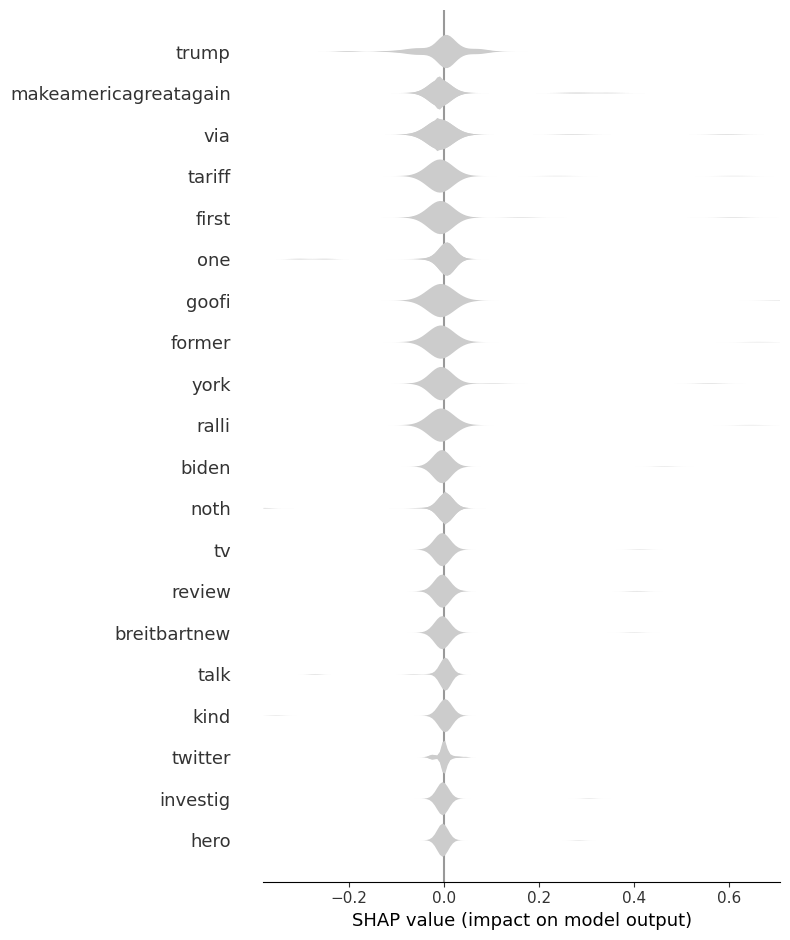
